# CarPlay 显示模块 FFmpeg 解码替换方案

## 目标与边界

- 目标：把 `carplay_display` 的 H264 解码从 `AW_MPI_VDEC_*` 切换为 `FFmpeg`，显示仍使用现有 `AW_MPI_VO + G2D`。
- 边界：仅改造解码链路，不改触摸映射、不改窗口矩形控制、不改 VO 时钟与显示线程主逻辑。
- 新代码位置：`/home/hyby/Desktop/myShare/Temp/Temp/runcarplay/src/carplay_display`。

## 现状关键点（用于对照迁移）

- 当前解码入口在 `carplay_display_feed_h264()`，进入 H264 包队列后由 `decode_thread_fn()` 调 `AW_MPI_VDEC_SendStream/GetImage`。
- 显示线程从 frame queue 取 `VIDEO_FRAME_INFO_S`，做 `g2d_rotate_frame()`，最终 `AW_MPI_VO_SendFrame()`。
- 编译系统已可访问 FFmpeg 头库目录：`/home/hyby/Desktop/myShare/Temp/Temp/external/ffmpeg/include` 与 `.../lib`。

## 新增文件与职责

- 新增头文件：`[/home/hyby/Desktop/myShare/Temp/Temp/runcarplay/src/carplay_display/carplay_ffmpeg_decoder.h](/home/hyby/Desktop/myShare/Temp/Temp/runcarplay/src/carplay_display/carplay_ffmpeg_decoder.h)`
  - 暴露最小接口：`create / decode_packet / flush / destroy`。
  - 输入：Annex-B H264 字节流（与现有 `feed_h264` 对齐）。
  - 输出：可被显示链路消费的 YUV420 帧描述（含 width/height/stride/plane 指针、PTS 可选）。
- 新增实现文件：`[/home/hyby/Desktop/myShare/Temp/Temp/runcarplay/src/carplay_display/carplay_ffmpeg_decoder.c](/home/hyby/Desktop/myShare/Temp/Temp/runcarplay/src/carplay_display/carplay_ffmpeg_decoder.c)`
  - 维护 `AVCodecContext/AVPacket/AVFrame/SwsContext` 生命周期。
  - 统一输出格式到 `AV_PIX_FMT_NV21`（优先）或 `AV_PIX_FMT_YUV420P`，避免显示端格式分叉。
  - 管理错误恢复：`send_packet/receive_frame` 的 `EAGAIN/EOF` 处理、SPS/PPS 前置保护、flush 流程。

## 主文件改造点

- 修改 `[/home/hyby/Desktop/myShare/Temp/Temp/runcarplay/src/carplay_display/carplay_display.c](/home/hyby/Desktop/myShare/Temp/Temp/runcarplay/src/carplay_display/carplay_display.c)`
  - 删除/停用 `AW_MPI_VDEC_CreateChn/SendStream/GetImage/ReleaseImage/DestroyChn` 路径。
  - 在 `carplay_display_create()` 初始化 `carplay_ffmpeg_decoder_create()`。
  - 在 `decode_thread_fn()` 中改为：
    1. 从现有 H264 包队列取包；
    2. 调 `carplay_ffmpeg_decoder_decode_packet()` 拉取 0~N 帧；
    3. 将输出帧拷贝到 MMZ/物理连续内存并封装为 `VIDEO_FRAME_INFO_S` 入 `g_fq`；
    4. 入队失败时按原策略丢旧帧。
  - 在 `carplay_display_destroy()` 调 `decoder_flush + decoder_destroy`，并释放新增 MMZ 帧池。

## 显示兼容策略（关键设计）

- 保留现有 display thread 与 `g2d_rotate_frame()`，确保改动收敛。
- 新增“FFmpeg帧到VO帧”桥接层：
  - 预分配 `N` 个 MMZ 输出缓冲（建议 4~6 个，分辨率按会话尺寸），每个缓冲生成一个 `VIDEO_FRAME_INFO_S` 模板。
  - 将 FFmpeg 输出按 stride 安全拷贝到 MMZ（Y + UV），并填充 `mPixelFormat/mWidth/mHeight/mPhyAddr/mpVirAddr`。
  - 通过本地引用计数/环形占用标记管理缓冲复用，替代 `AW_MPI_VDEC_ReleaseImage` 语义。
- 保留 `VO` 回调中对 G2D 三缓冲释放逻辑；VDEC release 逻辑替换为“归还自管帧池slot”。

## 编译与链接改造

- 修改 `[/home/hyby/Desktop/myShare/Temp/Temp/runcarplay/prj/linux/Makefile_sub](/home/hyby/Desktop/myShare/Temp/Temp/runcarplay/prj/linux/Makefile_sub)`
  - 增加头文件路径：`-I../../../external/ffmpeg/include`。
  - 增加库路径：`-L../../../external/ffmpeg/lib`。
  - 链接库新增：`-lavcodec -lavutil`（如启用 swscale 则加 `-lswscale`）。
  - 在 `CARPLAY_OBJS` 加入 `carplay_ffmpeg_decoder.o` 显式编译规则。

## 迁移实施顺序

1. 抽象解码接口并新建 `carplay_ffmpeg_decoder.[hc]`，先完成独立编译通过。
2. 在 `carplay_display.c` 接入新解码器，但先仅打印解码帧信息（不入VO），确认码流可解。
3. 接入 MMZ 帧池与 `VIDEO_FRAME_INFO_S` 封装，打通 `decode_thread -> g_fq -> display_thread`。
4. 删除旧 VDEC 专属清理逻辑，统一为 FFmpeg+帧池资源管理。
5. 回归验证：分辨率切换、掉帧策略、长时间播放稳定性、CPU占用。

## 风险与对策

- 软解 CPU 占用升高：先以 720p/20fps 评估，必要时开启 `skip_frame`/线程数调优。
- 像素格式不匹配导致色彩异常：固定输出 NV21 并校验 `g2d_format` 映射。
- 帧池复用时机错误导致花屏：用“in_use 标记 + VO回调归还”替代裸复用。
- 包不是完整帧：保留你现有 NAL/SPS 门控，FFmpeg侧增加 parser（可选）增强容错。

## 数据流示意

```mermaid
flowchart LR
  zlinkInput[ZlinkH264Input] --> packetQueue[H264PacketQueue]
  packetQueue --> ffmpegDec[carplay_ffmpeg_decoder]
  ffmpegDec --> frameBridge[FFmpegFrameToMMZFrame]
  frameBridge --> frameQueue[DisplayFrameQueue]
  frameQueue --> displayThread[DisplayThread]
  displayThread --> g2dRotate[G2DRotate]
  g2dRotate --> voSend[AW_MPI_VO_SendFrame]
```

## 验收标准

- `carplay_display_feed_h264()` 无接口变化，业务上层无需改动。
- 播放链路稳定运行，画面可持续显示且无明显错色/撕裂。
- 旧 VDEC 解码调用已移除，代码路径仅保留 FFmpeg 解码实现。
- 工程可在现有交叉编译环境下完整链接通过。

