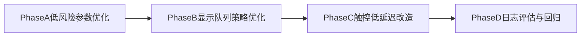

# CarPlay 解码显示优化方案

## 现状判断

当前框架（`zlink -> H264队列 -> AW VDEC -> 帧队列 -> G2D旋转/缩放 -> VO显示`）本身是可用的，不是“架构错误”。
主要问题是录像负载上来后，系统资源争用放大了解码送流抖动；另外触控链路存在“批处理+显示线程取最新帧”的延迟/平滑权衡。

- 关键代码路径：
  - 会话参数：`[/home/hyby/Desktop/myShare/Temp/Temp/runcarplay/src/carplay/zlink_client.c](/home/hyby/Desktop/myShare/Temp/Temp/runcarplay/src/carplay/zlink_client.c)`
  - 解码/显示线程：`[/home/hyby/Desktop/myShare/Temp/Temp/runcarplay/src/carplay_display/carplay_display.c](/home/hyby/Desktop/myShare/Temp/Temp/runcarplay/src/carplay_display/carplay_display.c)`
  - 触控事件采集与发包：`[/home/hyby/Desktop/myShare/Temp/Temp/runcarplay/src/carplay_display/link_touch_evdev.c](/home/hyby/Desktop/myShare/Temp/Temp/runcarplay/src/carplay_display/link_touch_evdev.c)`

## 方案总览（按风险分阶段）

### Phase A：低分辨率输入 + 显示端放大（先做A/B开关）

目标：降低解码与带宽压力，验证流畅性提升是否显著。

- 在 `[/home/hyby/Desktop/myShare/Temp/Temp/runcarplay/src/carplay/zlink_client.c](/home/hyby/Desktop/myShare/Temp/Temp/runcarplay/src/carplay/zlink_client.c)` 中把 `session_data.width/height` 从 `1440x720` 改为候选低分辨率（优先 `720x360`，若协商不支持则回退 `960x480`）。
- 保持显示逻辑在 `[/home/hyby/Desktop/myShare/Temp/Temp/runcarplay/src/carplay_display/carplay_display.c](/home/hyby/Desktop/myShare/Temp/Temp/runcarplay/src/carplay_display/carplay_display.c)` 使用现有 G2D/VO 全屏输出到 `1440x720`。
- 增加编译宏或运行时开关（例如 `ZLINK_SESSION_RES=720x360`）便于快速回退。
- 验证点：
  - `send_avg_us/send_fail/fq_skip` 是否下降
  - 画质是否可接受（文本锐度、地图线条、夜景噪点）

### Phase B：显示队列从“强追帧”改为“有限缓冲”

目标：降低视觉抖动，平衡流畅度与触控延迟。

- 将 `[/home/hyby/Desktop/myShare/Temp/Temp/runcarplay/src/carplay_display/carplay_display.c](/home/hyby/Desktop/myShare/Temp/Temp/runcarplay/src/carplay_display/carplay_display.c)` 中 `while (g_fq.count > 1)` 改为“仅在严重积压时丢到3帧”。
- 增加阈值常量：
  - `DISPLAY_KEEP_FRAMES=3`
  - `DISPLAY_DROP_THRESHOLD=5`（示例）
- 仅当 `g_fq.count > DISPLAY_DROP_THRESHOLD` 时丢旧帧到 `DISPLAY_KEEP_FRAMES`。
- 风险控制：
  - 在触控活跃窗口（例如最近 120ms）可临时降到保留 2 帧，避免明显触控滞后。

### Phase C：触控链路低延迟改造（建议“半即时”，不建议完全逐事件发送）

目标：提升跟手感，同时避免触控噪声和事件风暴。

- 对你提的 `2.2`：
  - 在 `[/home/hyby/Desktop/myShare/Temp/Temp/runcarplay/src/carplay_display/carplay_display.c](/home/hyby/Desktop/myShare/Temp/Temp/runcarplay/src/carplay_display/carplay_display.c)` 的 `carplay_touch_send_xy()` 中增加轻量唤醒是可行的，但建议只在“按下/移动”状态唤醒，避免无意义 signal。
- 对你提的 `2.3`：
  - 不建议把 `[/home/hyby/Desktop/myShare/Temp/Temp/runcarplay/src/carplay_display/link_touch_evdev.c](/home/hyby/Desktop/myShare/Temp/Temp/runcarplay/src/carplay_display/link_touch_evdev.c)` 改成“每个 EV_ABS 立即 emit”。
  - 建议改为“遇到 `SYN_REPORT` 立即 emit”模型：
    - 保留输入同步语义
    - 比当前 read-batch 末尾统一 emit 更低延迟
    - 明显低于逐事件 emit 的抖动和CPU开销
- 增加触控统计：
  - `touch_emit_interval_us`
  - `touch_to_next_display_us`
  - `touch_burst_drop_cnt`

### Phase D：统一评估与结论口径

- 对比四组场景：
  - 基线（当前）
  - 仅 Phase A
  - A+B
  - A+B+C
- 统一指标：
  - CarPlay：`send_avg_us`、`send_fail`、`fq_skip`、`disp`
  - 触控：`touch pipeline_us`、拖动轨迹抖动
  - 录像并发时：`RecRender/FsWriter` 长阻塞次数
- 输出结论模板：
  - “哪条接口仍是瓶颈”
  - “每个优化项收益/副作用/回退策略”

## 对你提出三点建议的结论

- **1) 720x360输入 + 放大显示**：方向正确，建议保留回退开关，先 A/B 验证画质与收益。
- **2.1 队列不再激进丢帧**：可做，但不要“完全不丢”；应改成“有阈值的弹性保留”，否则延迟会累积。
- **2.2 触控后唤醒显示线程**：可做，建议加条件触发，避免过度唤醒。
- **2.3 每个触控事件立即处理并发送**：不建议原样落地，建议改为 `SYN_REPORT` 触发发送的折中方案。

