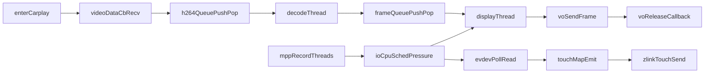

# CarPlay卡顿定位日志方案

## 目标与策略

- 采用你选择的 `短时深度追踪 + stdout`：默认进入 CarPlay 时开启高频日志，建议单次抓取 10-30 秒。
- 所有日志统一带上：`ts_us`、`tid`、`stage`、`session_id`、`seq`（包序号/帧序号/触控序号）。
- 优先输出“可计算指标”的结构化行日志（key=value），保证后续可用脚本直接算 P50/P95/P99。

## 关键观测链路（端到端）

## 分文件埋点设计

### 1) CarPlay进入与会话边界

- 文件：[lvgl_main.c](/home/hyby/Desktop/myShare/Temp/Temp/lvgl-gui/lvgl_main.c)
- 在 `enter_carplay` 分支增加“阶段耗时拆分”日志：
  - `reset_prebuffer`、`request_video_focus(1)`、`carplay_display_create`、`set_video_active(1)`、`request_video_focus(0)`、`ui_load_scr_animation`。
- 增加 `session_id`（每次进入CarPlay自增），后续传递到 zlink/display/touch 日志中。
- 记录“录像状态快照”（是否录像、码率、fsync开关）用于关联。

### 2) 视频接收与投递（手机包 -> 显示模块）

- 文件：[zlink_client.c](/home/hyby/Desktop/myShare/Temp/Temp/runcarplay/src/carplay/zlink_client.c)
- 在 `video_data_cb` 增加：
  - 每包：`pkt_seq`、`len`、`active`、`prebuf_count`、`feed_ret`、`cb_cost_us`。
  - 每 100 包聚合：包速率、平均包长、`feed_fail` 次数。
- 在 `zlink_client_set_video_active` 打印 prebuffer 回放耗时与回放包数（是否形成“启动抖动”）。
- 在 `video_focus_cb` 打印 focus 切换请求到生效的时延。

### 3) 解码队列/解码线程/帧队列

- 文件：[carplay_display.c](/home/hyby/Desktop/myShare/Temp/Temp/runcarplay/src/carplay_display/carplay_display.c)
- H264队列：
  - `queue_push`/`queue_pop` 记录 `q_count`、`q_wait_us`、丢包次数（队列满）。
- 解码线程：
  - `AW_MPI_VDEC_SendStream` 耗时与失败码。
  - `AW_MPI_VDEC_GetImage` 成功率、单包产帧数、超时比例。
  - SPS/IDR等待阶段耗时（是否卡在首帧门槛）。
- 帧队列：
  - 入队/出队深度、因 `FRAME_QUEUE_CAP` 满而丢旧帧次数。

### 4) 显示线程与VO回调

- 文件：[carplay_display.c](/home/hyby/Desktop/myShare/Temp/Temp/runcarplay/src/carplay_display/carplay_display.c)
- `display_thread_fn` 增加：
  - 等待帧耗时、`g2d_rotate_frame` 耗时、`AW_MPI_VO_SendFrame` 耗时。
  - 等待 `g2d_dst_in_use` 的阻塞时长（怀疑点：VO释放慢导致背压）。
- `carplay_vo_callback` 记录每次 buffer release 间隔；若释放间隔异常拉大则告警。

### 5) 触控线程端到端时延

- 文件：[link_touch_evdev.c](/home/hyby/Desktop/myShare/Temp/Temp/runcarplay/src/carplay_display/link_touch_evdev.c)
- 在 `poll/read/process/emit` 增加：
  - `poll_wakeup_interval_us`、单批次事件数、`read_loop_cost_us`。
  - 从首次 `EV_*` 到 `carplay_touch_send_xy` 的 `touch_pipeline_us`。
  - `noise_filter` 触发次数、`move_threshold` 抑制次数。
- 在 `carplay_touch_send_xy` / `touch_apply_and_send` 记录映射后的坐标与发送耗时，定位“触控卡”是输入慢还是发送慢。

### 6) 录像线程争用关联日志（重点）

- 文件：[mpp_camera.c](/home/hyby/Desktop/myShare/Temp/Temp/runcarplay/src/app/video/mpp_camera.c)
- 对录像关键路径增加周期统计（建议1秒一次）：
  - `VI_GetFrame` 阻塞耗时、`VENC_SendFrame` 耗时/失败率、`MUX_SwitchFd`/`fsync` 耗时。
  - 录像线程吞吐（帧率、码率估算）与存储故障标记。
- 打印线程调度信息快照（线程名、策略、优先级）用于确认 `carplay_decode/display/touch` 是否被录像线程抢占。

## 日志格式与开关设计

- 新增统一宏（建议放在 carplay 相关 `.c` 顶部或公共头）：
  - `CP_PERF_LOG(...)`：深度日志。
  - `CP_PERF_STAT_FLUSH(...)`：周期汇总日志。
- 运行时开关（环境变量）：
  - `CP_PERF_ENABLE=1`
  - `CP_PERF_DEEP=1`
  - `CP_PERF_SAMPLE_N=1|10|30`（每N个事件采样）
  - `CP_PERF_WARN_US=xxxx`（阈值告警）
- 为防止日志反向拖慢：
  - 高频点采用“采样+聚合+阈值即打”。
  - 原子计数器累积，1秒统一 flush 一次摘要。

## 预期可定位的问题类型

- `queue满/丢包`：接收速度 > 解码速度。
- `decode慢`：`SendStream/GetImage` 耗时高或失败率高。
- `display背压`：VO release 间隔大、g2d buffer 长时间占用。
- `touch慢`：poll唤醒慢或 emit/send 链路耗时升高。
- `录像抢占`：录像路径耗时峰值与触控/显示抖动时间窗重合。

## 验证与交付

- 触发场景：录像开启 -> 进入 CarPlay -> 连续滑动/点击 20 秒。
- 交付日志：stdout 原始日志 + 一份字段说明（如何计算端到端延时、掉帧率、队列峰值）。
- 成功标准：明确卡顿主瓶颈位于 `输入 / 解码 / 显示 / 存储IO与调度争用` 中至少一个，并给出证据链。

