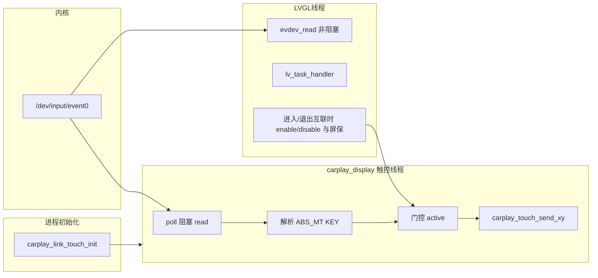

# 手机互联触控：独立 evdev 线程方案（修订版）

## 目标

1. **源码位置**：触控线程与 evdev 解析实现放在 [runcarplay/src/carplay_display/](runcarplay/src/carplay_display/)（例如 `link_touch_evdev.c` / `link_touch_evdev.h`），与现有 `carplay_display.c`、`carplay_touch_send_xy` 同模块。
2. **与 LVGL 解耦**：不再通过 `indev_drv.feedback_cb` 或 LVGL 主循环轮询当前屏来转发；采样与 zlink 上报在独立线程完成，LVGL 仍仅用现有 `evdev_read` 驱动 UI。
3. **门控**：**仅在实际进入互联投屏链路时**（与 [lvgl-gui/lvgl_main.c](lvgl-gui/lvgl_main.c) 中 `session_rising` 分支、`carplay_display_create` + `ui_load_scr_animation` 到 CarPlay/AA 全屏一致；以及 [lvgl-gui/ui/generated/screen_events_init.c](lvgl-gui/ui/generated/screen_events_init.c) 中用户点击图标且 `zlink_client_is_session_started()` 与 `linktype` 匹配时的同类路径）**开启**向 zlink 发送触控；**退出互联全屏或 `carplay_display_destroy` 时关闭**，停止发送。
4. **屏保**：进入上述互联投屏状态后**一定不会触发屏保**——在 LVGL 线程于「进入」点调用 `destoryDashAnalogTimer()`；在「退出」点若 `g_sys_Data.agingMode.screenSaveSw` 为真则按原间隔 `createDashAnalogTimer(...)` 恢复。不再依赖互联屏上的触摸去 `resetDashAnalogTimer`（可删除原 `feedback_cb` 中的屏保逻辑）。

## 现状与瓶颈（简要）

- LVGL 侧 `evdev_read` 非阻塞、随 `lv_task_handler()` 节奏读屏；`feedback_cb` 把坐标发往 zlink，延迟与 LVGL 卡顿耦合。

## 架构

## 设计要点

1. **第二路 `open`**
  与现有方案相同：独立 fd 读同一 evdev 节点（默认 `/dev/input/event0`，若存在 `/dev/input/touchscreen` 则优先，与 [lvgl-gui/lv_drivers/indev/evdev.c](lvgl-gui/lv_drivers/indev/evdev.c) 行为一致）。**不**与 LVGL 共享同一 fd。若平台多 `open` 异常，再用「单线程读 + 队列」兜底（真机用 `evtest`/双进程验证）。
2. **阻塞等待**
  专用 fd 使用 `poll` + **阻塞** `read(struct input_event)`，与 LVGL 节拍无关。
3. **解析与坐标**
  逻辑对齐当前 `evdev_read`（`EV_ABS` / `ABS_MT_*` / `BTN_TOUCH` 等）；裁剪分辨率与 [carplay_display.c](runcarplay/src/carplay_display/carplay_display.c) 中 `touch_apply_and_send` 使用的逻辑坐标一致（`LVGL_LOGICAL_W/H` 1440×720）。  
   **编译**：新文件编入 **runcarplay**，避免依赖 [lvgl-gui/lv_drv_conf.h](lvgl-gui/lv_drv_conf.h)；`EVDEV_SWAP_AXES` 等若需一致，可在 `link_touch_evdev.h` 中维护同名宏或复制默认值。
4. **门控 API（建议）**
  - `void carplay_link_touch_init(void);` — 创建并启动线程（空闲循环，active=0 时不调用 zlink）。  
  - `void carplay_link_touch_set_active(int active);` — `0` 停止转发，`1` 允许转发（若需区分 CarPlay/AA 仅日志，底层均为 `carplay_touch_send_xy`）。  
   仅允许在**已持有 LVGL 锁或明确在 UI 回调线程**的进入/退出点调用 `set_active`，避免与 UI 竞态；内部用 `_Atomic int` 或 mutex 对触控线程可见。
5. **在哪些位置 `set_active(1)`**
  与 `**carplay_display_create(...)` 成功执行之后**绑定（与业务一致：未起投屏的提示页不转发，避免误触 zlink）：  
  - [lvgl_main.c `lvgl_handle_zlink_ui_requests](lvgl-gui/lvgl_main.c)` 中 CarPlay / Android Auto 的 `session_rising && on_target_screen` 分支，在 `carplay_display_create` 与后续 `ui_load_scr_animation` 之后调用 `carplay_link_touch_set_active(1)`。  
  - [screen_events_init.c](lvgl-gui/ui/generated/screen_events_init.c) 中 `screen_btn_carplay` / `screen_btn_androidauto` 的 `CLICKED` 分支，在 `if (zlink_client_is_session_started() && ...)` 内 `carplay_display_create` 成功后同样 `set_active(1)`。  
   **注意**：若仅 `ui_load` 到互联屏而未执行 `create`，**不得** `set_active(1)`。
6. **在哪些位置 `set_active(0)`**
  所有离开互联全屏或销毁显示的路径，例如：  
  - `lvgl_handle_zlink_ui_requests` 中 `zlink_client_take_pending_home_request` 回到主屏；  
  - [screen_carPlay_events_init.c](lvgl-gui/ui/generated/screen_carPlay_events_init.c) / [screen_androidAuto_events_init.c](lvgl-gui/ui/generated/screen_androidAuto_events_init.c) 返回主屏的 `CLICKED`；  
  - [zlink_client.c](runcarplay/src/carplay/zlink_client.c) 中调用 `carplay_display_destroy()` 处（断连等），在 `destroy` 后或同时 `set_active(0)`，保证无 UI 时也不发触控。
7. **移除 LVGL `feedback_cb`**
  [lvgl_main.c](lvgl-gui/lvgl_main.c) 去掉 `indev_drv.feedback_cb` 与 `lv_touch_feedback_cb`（及其中 `resetDashAnalogTimer`）。
8. **线程初始化位置（与 LVGL 解耦）**
  在 [runcarplay/src/app/main/MainThread.cpp](runcarplay/src/app/main/MainThread.cpp)（`LvglService` 前后均可，按依赖顺序）对 `ENABLE_CARPLAY` 调用 `carplay_link_touch_init()`，使触控线程生命周期不依赖 `lv_task_handler`。
9. **构建**
  在 [runcarplay/prj/linux/Makefile_sub](runcarplay/prj/linux/Makefile_sub) 的 `CARPLAY_OBJS` 中增加 `$(OBJROOTDIR)/carplay_display/link_touch_evdev.o` 及对应编译规则，`clean` 同步更新。**不再**向 [lvgl-gui/Makefile](lvgl-gui/Makefile) 增加该 `.c`。
10. **屏保实现细节**
  `destoryDashAnalogTimer` / `createDashAnalogTimer` 声明在 [setup_scr_screen_screenSave.c](lvgl-gui/ui/generated/setup_scr_screen_screenSave.c)；若 runcarplay 不便包含，可在 [lvgl_main.c](lvgl-gui/lvgl_main.c)（或极薄 `link_ui_hooks.c`）封装 `link_ui_on_projection_entered()` / `link_ui_on_projection_exited()`：内部调屏保 API + 对外由上述进入/退出点各调用一次（或进入/退出集中宏/函数减少重复）。

## 风险与验证

- 双 `open` 与 `libzlink_touch_event` 线程安全：同原方案；必要时在 `carplay_touch_send_xy` 外增加互斥。  
- 实机：投屏界面跟手、主界面/设置不误发、断连与返回键后无残留触控、互联停留期间屏保不出现、退出后屏保开关行为与设置一致。

待你确认本方案后再开始 Build 与改代码。