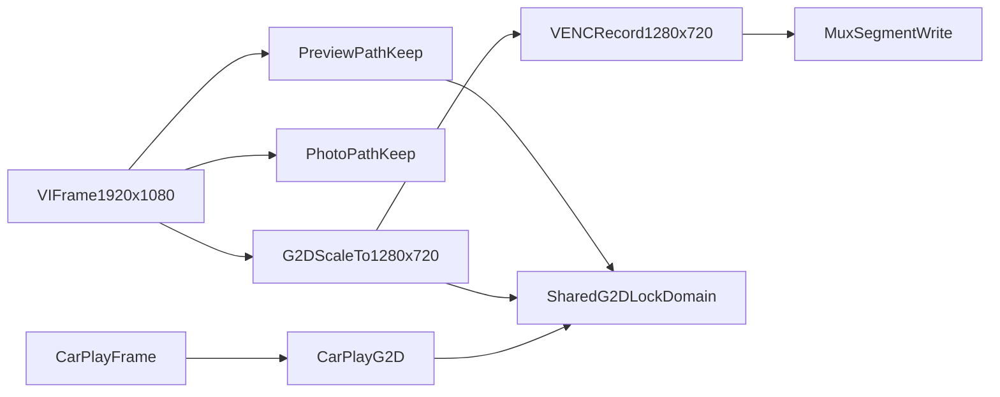

# 双路录像改为G2D 720p编码方案

## 目标与边界

- 目标：前后两路录像（`vipp0`、`vipp8`）统一改为 `1920x1080 -> G2D -> 1280x720 -> VENC -> MUX`。
- 保持不变：预览显示路径、拍照路径、容器封装与切片逻辑、音频链路。
- 仅调整录像视频输入分辨率，不改业务层调用时序。

## 现状关键点

- 当前录像发送点在 `[/home/hyby/Desktop/myShare/Temp/Temp/runcarplay/src/app/video/mpp_camera.c](/home/hyby/Desktop/myShare/Temp/Temp/runcarplay/src/app/video/mpp_camera.c)` 的录像线程（`Vi2VencFrameThread`）中，直接把VI帧送入 `AW_MPI_VENC_SendFrame`。
- 代码内已有G2D缩放能力（`G2D_Convert_Scale`/相关buffer分配），但主要用于预览链路，尚未作为录像编码输入。
- 现有系统至少存在两处G2D调用域：录像/预览链路（`mpp_camera.c`）与CarPlay显示链路（`carplay_display.c`），两处锁当前非同一把锁，存在并发竞争风险。

## 实施设计

- 在录像链路新增“录像专用G2D输出帧”管理：
  - 新增录像缩放输出buffer（`1280x720`）及对应 `VIDEO_FRAME_INFO_S`。
  - buffer生命周期独立于预览buffer，避免互相覆盖。
- 调整录像线程输入：
  - `Vi2VencFrameThread` 不再直接送VI原始帧；改为先执行G2D缩放，再送缩放后帧给 `m_venc`。
  - 保持帧时间戳/ID透传，确保封装时间轴连续。
- 新增并落实G2D并发控制（重点）：
  - 引入“统一G2D锁域”：录像G2D、预览G2D、CarPlay显示G2D都使用同一套互斥对象或统一封装接口，避免多把锁各自保护导致并发访问硬件。
  - 约束锁粒度：仅覆盖 `g2d_blit_h/g2d_ioctl` 等硬件调用区间，不包裹耗时的队列操作、编码发送或文件IO，避免扩大临界区。
  - 明确锁顺序：若同时涉及模块内锁（队列锁/文件锁）与G2D锁，固定“先业务锁后G2D锁”或反之并全局一致，避免死锁。
  - 统一错误路径释放：任何G2D失败分支必须保证解锁，避免异常路径遗留锁占用。
- 更新录像编码参数分辨率：
  - 录像VENC创建参数改为 `1280x720`。
  - 码率/GOP/RC模式保持现有策略（仅沿用现有参数体系，不新增策略分支）。
- 明确隔离预览与拍照：
  - 预览继续使用原有预览缩放/旋转buffer及VO发送逻辑。
  - 拍照继续使用原有抓拍分支与JPEG编码，不复用录像缩放buffer。

## 具体改动文件

- 核心改动：`[/home/hyby/Desktop/myShare/Temp/Temp/runcarplay/src/app/video/mpp_camera.c](/home/hyby/Desktop/myShare/Temp/Temp/runcarplay/src/app/video/mpp_camera.c)`
- 锁域联动：`[/home/hyby/Desktop/myShare/Temp/Temp/runcarplay/src/carplay_display/carplay_display.c](/home/hyby/Desktop/myShare/Temp/Temp/runcarplay/src/carplay_display/carplay_display.c)`（统一G2D互斥接入）
- 可能联动：`[/home/hyby/Desktop/myShare/Temp/Temp/runcarplay/src/app/video/mpp_camera.h](/home/hyby/Desktop/myShare/Temp/Temp/runcarplay/src/app/video/mpp_camera.h)`（若需补充录像缩放buffer结构声明）

## 风险与控制

- 风险：录像线程新增G2D步骤后，实时性和队列积压风险上升。
- 风险：多模块并发调用G2D（录像/预览/CarPlay）时出现硬件访问冲突或死锁。
- 控制：
  - 复用现有G2D接口与MMZ分配方式，减少改动面。
  - 统一G2D锁域并固定锁顺序，先完成锁策略再接入录像缩放路径。
  - 保持原有线程模型，不改封装事件处理逻辑。
  - 增加关键日志（缩放失败、送帧失败、队列堆积）便于回归。

## 验证与Build计划

- 功能验证：
  - 前后双路录像文件实际分辨率为 `1280x720`。
  - 预览分辨率与显示行为无变化。
  - 拍照分辨率/成功率无回归。
  - 分段切片与紧急录像切换正常。
- 稳定性验证：持续录像、频繁切片、并发预览+录像+拍照场景无异常。
- 并发验证：同时开启CarPlay显示 + 双路录像 + 预览时，G2D路径无卡死、无明显帧阻塞、无死锁日志。
- 通过后执行项目build，并反馈编译结果与关键日志检查项。

