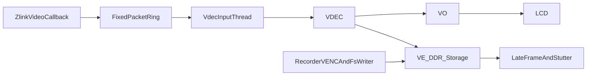

---

name: 手机互联卡顿优化方案
overview: 基于当前 `VDEC -> VO` 绑定、VE 内部旋转的实现，优先削减手机互联链路自身的拷贝/分配/背压开销，再针对录像并发下的 VE 与写盘争抢做隔离，目标是在不回退到旧外部 G2D 搬运链的前提下明显降低卡顿。
todos:

- id: optimize-ingress-prebuf
content: 收敛 zlink_client 输入链，active 后不再双重排队，并将 prebuf 改为环形缓存
status: pending
- id: refactor-h264-queue
content: 将 carplay_display 的 H264 队列改为固定块池/环形队列，去掉每包 malloc/free 并补充统计
status: pending
- id: tune-sendstream-backpressure
content: 优化 VDEC_SendStream 的超时与重试策略，避免单次长阻塞放大卡顿
status: pending
- id: prioritize-carplay-path
content: 评估并提升 carplay 关键线程优先级，降低被录像编码与写盘任务抢占的概率
status: pending
  - id: reduce-mmz-hotpath-cost
  content: 优化 MMZ 流缓冲与 flush 热路径，降低输入侧带宽和 CPU 开销
  status: pending
  - id: isolate-recorder-contention
  content: 排查并缓解录像链的 VENC 输出阻塞与写盘长延迟对互联的放大影响
  status: pending
- id: add-lightweight-metrics
content: 增加轻量级运行统计，记录帧间隔、队列深度、丢包率与喂流耗时，用数据验证优化效果
status: pending
  - id: verify-rotation-ab
  content: 在应用侧抖动收敛后，对比 VE 内部旋转与 G2D 旋转在录像并发场景下的表现
  status: pending
  isProject: false

---

# 手机互联卡顿优化方案

## 目标

- 保持当前 [runcarplay/src/carplay_display/carplay_display.c](/home/hyby/Desktop/myShare/v853s_sample-new/v853s_sample-new/runcarplay/src/carplay_display/carplay_display.c) 的 `VDEC -> VO` 绑定显示路径，不回退到旧的外部 G2D 三缓冲搬运链。
- 优先解决手机互联链路自身的卡顿来源：多次 `malloc/memcpy`、预缓冲 `memmove`、`SendStream(200ms)` 背压、队列满后静默丢包。
- 补上线程调度与可观测性：提高 carplay 关键线程的调度优先级，并用轻量统计验证每轮优化是否真正降低卡顿。
- 对录像并发场景做保守隔离，重点缓解日志中已经出现的 `venc timeout for waiting outputStream`、`F671 timeout enc reg`、`FsWriter ... [2713/2727]ms` 所代表的 VE/存储争抢。

## 现状判断

- 当前互联输入链路仍有两级应用侧缓存与两次动态分配：在 [runcarplay/src/carplay/zlink_client.c](/home/hyby/Desktop/myShare/v853s_sample-new/v853s_sample-new/runcarplay/src/carplay/zlink_client.c) 的 `video_data_cb()` 中，数据先进入 `prebuf_push_locked()`，随后 active 时再次进入 `carplay_display_feed_h264()`。
- `prebuf_push_locked()` 在预缓冲满时会 `memmove()` 整个数组，并且每包都 `malloc()`，这是实时链路中的高成本热点。
- [runcarplay/src/carplay_display/carplay_display.c](/home/hyby/Desktop/myShare/v853s_sample-new/v853s_sample-new/runcarplay/src/carplay_display/carplay_display.c) 里 `queue_push()` 再次 `malloc/memcpy`，解码线程又把包拷进 MMZ，并在每包后 `AW_MPI_SYS_MmzFlushCache()`，热路径开销偏大。
- 当前 `AW_MPI_VDEC_SendStream(..., 200)` 是单线程喂流，发生 VDEC/VE 忙时会长时间阻塞；日志里不开录像时已出现大量 `Late frame` 和 `wait vbs data timeout`，说明仅靠去掉外部 G2D 还不够。
- 当前 carplay 关键线程没有在方案中显式提升优先级；在录像编码与写盘长阻塞存在的情况下，调度抢占本身就可能进一步拉大 `Late frame`。
- 开录像后，日志新增 [log/第四版运行日志.log](/home/hyby/Desktop/myShare/v853s_sample-new/v853s_sample-new/log/第四版运行日志.log) 中的 `vencChn timeout for waiting outputStream`、`F671 timeout enc reg`、`FsWriter ... 2713/2727ms`，说明录像编码和写盘会进一步放大互联卡顿。
- 当前方案里虽有基础 dropped/queue depth 统计，但还缺少帧间隔、喂流耗时、解码侧等待时间等统一统计口径，不利于量化优化收益。

## 优化思路

核心原则：先把互联链路中应用侧可控的抖动压下去，再处理录像并发的资源放大效应；旋转策略只作为第三优先级的 A/B 验证项，不作为第一刀。

## 实施步骤

### 1. 收敛互联输入缓存，去掉 active 状态下的双重排队

在 [runcarplay/src/carplay/zlink_client.c](/home/hyby/Desktop/myShare/v853s_sample-new/v853s_sample-new/runcarplay/src/carplay/zlink_client.c) 中调整 `video_data_cb()` / `prebuf_push_locked()` 的职责：

- 仅在“会话未 active、需要首屏预缓冲”阶段保留 prebuf。
- 一旦 `g_video_state.active=1`，不要再同时进入 prebuf 和 display queue，两条路径二选一。
- 将当前 `PREBUF_PACKET_CAP` 的顺序数组 + `memmove()` 改成真正的环形队列，避免满队列时整体搬移。
- 保留现有首屏逻辑，但让 prebuf 成为“激活前缓存”，而不是整个会话生命周期都参与热路径。

### 2. 把互联包队列改成固定块池/环形队列，去掉每包 malloc/free

在 [runcarplay/src/carplay_display/carplay_display.c](/home/hyby/Desktop/myShare/v853s_sample-new/v853s_sample-new/runcarplay/src/carplay_display/carplay_display.c) 中重构 `g_queue`：

- 用固定容量的 packet pool + ring index 代替当前 `queue_push()` 中的 `malloc()` / `free()`。
- 让 H264 包进入队列时只做一次拷贝，不再频繁触发堆分配。
- 队列满时不要简单返回 `-1` 静默丢包；改为明确的“丢最旧非关键包/统计 dropped 数/必要时优先保留含 SPS/IDR 的包”。
- 增加轻量统计点：入队数、丢包数、最大队列深度、`SendStream` 重试次数，用于验证优化是否生效。

### 3. 收敛喂流阻塞时间，避免 `SendStream(200ms)` 放大抖动

仍在 [runcarplay/src/carplay_display/carplay_display.c](/home/hyby/Desktop/myShare/v853s_sample-new/v853s_sample-new/runcarplay/src/carplay_display/carplay_display.c) 中优化 `decode_thread_fn()`：

- 把 `AW_MPI_VDEC_SendStream(..., 200)` 调整为更保守的短超时重试策略，避免单次阻塞 200ms 把整条喂流线程挂住。
- 失败时根据返回值区分“暂时忙”和“真正异常”，忙时短等待/让出 CPU 后重试，不直接丢弃所有后续节奏。
- 当输入队列积压超过阈值时，优先主动丢弃非关键帧，保留含 SPS/IDR 的关键恢复点，避免“长时间排队后整体过期”或静默随机丢包。
- 结合当前 `wait vbs data timeout` 的已知成因，只把它当作静帧停包的背景现象，不再在应用层追加任何会引起抖动的恢复动作。

### 4. 提升 carplay 关键线程优先级，降低被录像链抢占的概率

在 [runcarplay/src/carplay_display/carplay_display.c](/home/hyby/Desktop/myShare/v853s_sample-new/v853s_sample-new/runcarplay/src/carplay_display/carplay_display.c) 和必要时的 [runcarplay/src/carplay/zlink_client.c](/home/hyby/Desktop/myShare/v853s_sample-new/v853s_sample-new/runcarplay/src/carplay/zlink_client.c) 中补充调度策略：

- 至少对互联喂流线程、必要的视频回调转发线程评估 `pthread_setschedparam()` / nice 值调整的可行性。
- 目标不是盲目抢最高优先级，而是让 carplay 实时路径稳定高于普通写盘任务，低于系统关键线程。
- 如目标平台权限或调度策略受限，也要保留“优先级设置是否成功”的日志，避免误以为已生效。

### 5. 降低 MMZ 写入与缓存刷新的热路径成本

在 [runcarplay/src/carplay_display/carplay_display.c](/home/hyby/Desktop/myShare/v853s_sample-new/v853s_sample-new/runcarplay/src/carplay_display/carplay_display.c) 中检查喂流缓冲的使用方式：

- 评估单块 `stream_buf` 是否会形成覆盖等待；如 SDK 允许，改成 2-4 个固定 MMZ 流缓冲槽位轮转，减少“上一个包尚未被消费、本线程已写下一个包”的阻塞概率。
- 在保证正确性的前提下，收敛 `AW_MPI_SYS_MmzFlushCache()` 的调用粒度，不做额外无收益的重复 flush。
- 保持 `VDEC -> VO` 绑定不变，只优化输入喂流侧。

### 6. 对录像并发做隔离，不直接改录像功能边界

优先分析并最小化录像对互联的放大影响，重点文件预计在 [runcarplay/src/app/video/mpp_camera.c](/home/hyby/Desktop/myShare/v853s_sample-new/v853s_sample-new/runcarplay/src/app/video/mpp_camera.c) 及其关联录像链：

- 结合日志里的 `dst_fps=0`、`timeout for waiting outputStream`、`F671 timeout enc reg`，优先核查录像 VENC 初始化参数和输出线程是否存在异常配置或取流不及时。
- 针对 `FsWriter ... 2713/2727ms`，优先确认写盘线程是否同步阻塞过长；若录像链已有队列能力，优先扩大写盘缓冲或减少强制 flush，避免拉长系统调度延迟。
- 目标不是重构录像模块，而是避免录像链把 VE/DDR/存储抖动直接放大到互联体验上。

### 7. 增加轻量级统计，确保优化有数据支撑

在 [runcarplay/src/carplay/zlink_client.c](/home/hyby/Desktop/myShare/v853s_sample-new/v853s_sample-new/runcarplay/src/carplay/zlink_client.c) 与 [runcarplay/src/carplay_display/carplay_display.c](/home/hyby/Desktop/myShare/v853s_sample-new/v853s_sample-new/runcarplay/src/carplay_display/carplay_display.c) 中增加轻量级统计：

- 输入侧：回调帧间隔、预缓冲深度、active 阶段的实时队列深度、主动丢包次数、关键帧保留命中次数。
- 喂流侧：`AW_MPI_VDEC_SendStream()` 耗时、短超时重试次数、最长连续阻塞时间。
- 会话级：每隔固定时间打印一行摘要，而不是逐帧刷日志，避免统计本身成为负担。
- 验证方式统一成“优化前/后同场景对比”，以日志中 `Late frame`、自定义统计和主观流畅度共同判断。

### 8. 将旋转方式作为第三优先级 A/B 验证项，而不是第一刀

用户当前已把 [runcarplay/src/carplay_display/carplay_display.c](/home/hyby/Desktop/myShare/v853s_sample-new/v853s_sample-new/runcarplay/src/carplay_display/carplay_display.c) 中 `bRotateUseG2d` 改为 `FALSE`，即优先使用 VE 内部旋转。基于日志，建议：

- 第一轮先不回退当前选择，先完成输入链路和录像隔离优化。
- 同时保留一个很薄的 A/B 开关，便于在同机型上对比 `bRotateUseG2d=FALSE/TRUE` 在“开录像并发”场景下的表现。
- 如果应用侧抖动压下去后，录像并发下仍主要表现为 VE 争抢，再用这组 A/B 数据决定是否需要在 CarPlay 场景恢复内部 G2D 旋转作为特定机型兼容分支。

## 验证方式

- 对比 [log/第四版运行日志.log](/home/hyby/Desktop/myShare/v853s_sample-new/v853s_sample-new/log/第四版运行日志.log) 与 [log/不开启录像功能运行日志.log](/home/hyby/Desktop/myShare/v853s_sample-new/v853s_sample-new/log/不开启录像功能运行日志.log) 中以下指标是否下降：
  - `AirPlayReceiverSessionScreen Late frame`
  - `wait vbs data timeout`
  - 互联自定义 `frame interval / queue depth / dropped / send retry / send cost` 统计
- 分别验证“不开录像互联”和“开录像互联”两种场景，确认：
  - 首屏时间没有明显恶化
  - CarPlay / Android Auto 方向、裁剪、显示区域保持正确
  - 开录像时卡顿明显下降，且不新增黑屏/重启类问题
  - 提升线程优先级后，没有引入录像链明显饥饿或系统调度异常

## 重点文件

- [runcarplay/src/carplay/zlink_client.c](/home/hyby/Desktop/myShare/v853s_sample-new/v853s_sample-new/runcarplay/src/carplay/zlink_client.c)
- [runcarplay/src/carplay_display/carplay_display.c](/home/hyby/Desktop/myShare/v853s_sample-new/v853s_sample-new/runcarplay/src/carplay_display/carplay_display.c)
- [runcarplay/src/app/video/mpp_camera.c](/home/hyby/Desktop/myShare/v853s_sample-new/v853s_sample-new/runcarplay/src/app/video/mpp_camera.c)
- [log/第四版运行日志.log](/home/hyby/Desktop/myShare/v853s_sample-new/v853s_sample-new/log/第四版运行日志.log)
- [log/不开启录像功能运行日志.log](/home/hyby/Desktop/myShare/v853s_sample-new/v853s_sample-new/log/不开启录像功能运行日志.log)

## 预期结果

- 不开录像时，互联链路的 `Late frame` 和主观卡顿先明显收敛。
- 开录像时，即使仍有一定资源争抢，也不再像当前这样被 `VENC/FsWriter` 长阻塞显著放大。
- 若最终确认瓶颈主要落在 VE 旋转争抢，再依据 A/B 数据决定是否对 `bRotateUseG2d` 做机型化兼容，而不是直接回退整条旧链路。

